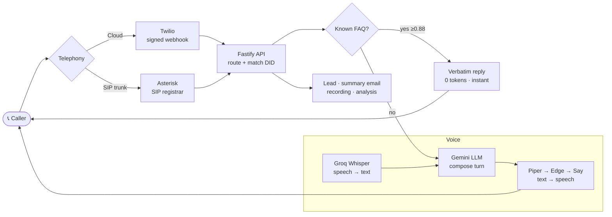

<h1 align="center">Ivaylo — Full-Stack & Applied-AI Engineer</h1>

  I build production AI systems end-to-end — real-time voice agents, multi-tenant CRMs, and the infra that runs them.

  
  
  
  
  
  
  

  
  
  
  
  

---

## 🎙️ Featured — AI Voice Receptionist

A real-time AI phone agent for UK insurance brokers: it answers live calls, understands the caller, and either resolves the query or routes to a human — running across **both cloud (Twilio) and on-prem SIP** telephony.

**What I engineered**
- **Dual telephony engine** — one turn loop serving both Twilio (cloud webhooks) and SIP (Asterisk registration), abstracted as provider *capabilities* rather than brand branches
- **A provider framework** to onboard new VoIP providers (3CX, Gamma, 8x8, BT Cloud Voice, RingCentral, Vonage) behind feature flags, with a versioned desired-state feed for the SIP worker
- **Sub-second "verbatim" tier** — high-confidence FAQ answers served deterministically, **0 LLM tokens**, before the model is ever called
- **Layered TTS fallback** (self-hosted Piper → Edge → carrier `<Say>`) so a synth timeout never drops a live call
- **Security-first webhooks** — per-tenant HMAC signature verification, credentials encrypted at rest, tenant-scoped call lookups

---

## 🧰 Also in the stack
`zod` · JWT auth · secretbox (tweetnacl) encryption · snapshot persistence to Postgres JSONB · Vitest (~2.9k tests) · nginx + systemd on a self-managed VPS · one-command deploy pipeline

## 📫 Reach me
<!-- add your links: LinkedIn / email / site -->
